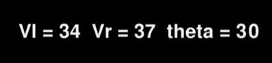
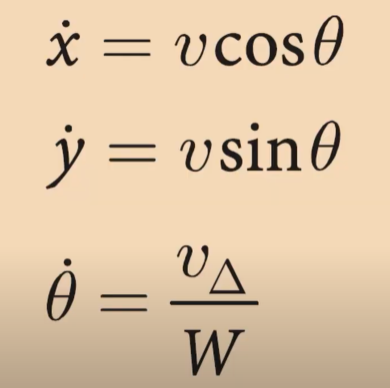

# Mobile Robot Simulation
This is a simple simulation of a mobile robot using `python` and `pygame`.


- **Vl** : velocity of left wheel
- **Vr** : velocity of right wheel
- **θ(theta)** : angle of robot




- **x(dot)** is the velocity of the robot in the x direction

- **y(dot)** dot is the velocity of the robot in the y direction

- **θ(dot)** is the angular velocity of the robot

## Create class
- Environment class : write_info, trail, etc,...
    - Tạo thuộc tính `dimentions` cho môi trường. 
    ``` python
    (dimentions)
    ```
    - Tạo các thuộc tính đại diện cho các màu sắc thường dùng.
        
        Được biểu diễn dưới dạng mã màu **RGB (Red, Green, Blue)** dùng cho các đối tượng trong môi trường.
        ``` python
        self.black = (0, 0, 0)
        self.white = (255, 255, 255)
        self.red = (255, 0, 0)
        self.green = (0, 255, 0)
        self.blue = (0, 0, 255)
        self.yellow = (255, 255, 0)
        ```
    - Tạo kích thước bản đồ môi trường.
        - Kích thước bản đồ môi trường được sử dụng để định nghĩa không gian hoạt động.
        - Giá trị `dimention[0]` là giá trị đầu tiên trong mảng dữ liệu chiều cao và giá trị `dimention[1]` là giá trị thứ hai trong mảng dữ liệu chiều rộng.
        ``` python
        self.height = dimentions[0]
        self.width = dimentions[1]
        ```
    - Thiết lập tiêu đề tạo giao diện đồ họa.
        - Thiết lập caption cho cửa sổ hiển thị.
        - `pygame.display.set_mode` : Tạo ra một bề mặt (Surface) dùng để vẽ các đối tượng trong môi trường và dùng `self.map` để lưu trữ bề mặt đó với kích thước được chỉ định là `self.width` và `self.height`.
        ``` python
        pygame.display.set_caption("Mobile Robot Simulation")
        self.map=pygame.display.set_mode((self.width, self.height))
        ```

- Robot class : draw, move, update, etc,...
    - Tạo các thuộc tính như `start position`, `robot img`, `width` cho robot.
    ``` python
    (start_position, robot_img, width)
    ``` 
    - Tạo giá trị `meter_to_pixel` để chuyển đổi giá trị từ m/s sang pixel/s (1 m/s = 3779.5275590551 pixel/s)
    ``` python

## initialization
- Khởi tạo pygame để thực thi chương trình.
    ``` python
    pygame.init()
    ```

- Tạo một giá trị lưu trữ tọa độ bắt đầu trong môi trường. Cần xác định vị trí bắt đầu của một đối tượng trong môi trường.
    - `start` : Lưu trữ tọa độ bắt đầu của robot trong môi trường.
    - `(200, 200)` : tuple đại diện cho tọa độ x = 200 và tọa độ y = 200.
    ``` python
    start = (200, 200)
    ```

- Tạo một giá trị lưu trữ kích thước của môi trường.
    - `dimentions` : Lưu trữ kích thước của môi trường.
    - `(600, 1200)` : tuple đại diện cho chiều cao = 600 và chiều rộng = 1200.
    ``` python
    dimention = (600, 1200)
    ```

- Tạo một cờ (flag) để kiểm soát vòng lặp chính của chương trình
    - `running` : Cờ kiểm soát vòng lặp chính của chương trình. Khi đóng cửa sổ, cờ này sẽ được chuyển thành `False` và thoát khỏi vòng lặp chính.
    ``` python
    running = True
    ```

- Tạo một đối tượng đại diện cho **class** `Environment` và truyền tham số đầu vào *lưu trữ kích thước của môi trường* `dimention` vào để khởi tạo kích thước của môi trường và cách thuộc tính khác.
    ``` python
    env = Environment(dimention)
    ```

- Tạo vòng lặp để thực thi chương trình.
    - `running` **(flag)** : Có chức năng kiểm soát vòng lặp chính của chương trình.
    - `pygame.event.get()` : Lấy tất cả các sự kiện trong hàng đợi sự kiện.
      - Ví dụ: nhấn phím, click chuột, đóng/tắt cửa sổ, etc...
    - `event` : Tạo biến **sự kiện** để kiểm tra các sự kiện trong hàng đợi sự kiện.
    - `event.type` : Kiểm tra loại sự kiện.
    - `pygame.QUIT` : Sự kiện thoát khỏi chương trình.
    - `pygame.display.update()` : Cập nhật cửa sổ hiển thị
    - `env.map.fill(env.black)` : Đổ màu đen vào bản đồ môi trường.
    
    - Khi thực thi **running**, các sự kiện trong **pygame.event.get()** sẽ được lấy ra và kiểm tra bởi **event.type**.
        
        - Nếu không phát hiện `pygame.QUIT` thì thực thi **display.update()** để cập nhật cửa sổ hiển thị và **env.map.fill(env.black)** để đổ màu vào bản đồ môi trường. 
        
        - Nếu phát hiện là `pygame.QUIT` thì **running** sẽ được chuyển thành **False** và thực thi **pygame.quit()** để thoát khỏi chương trình.
    ``` python 
    while running:
        for event in pygame.event.get():
            if event.type == pygame.QUIT:
                running = False
            
        pygame.display.update()
        env.map.fill(env.black)
    ```
## animation loop


****