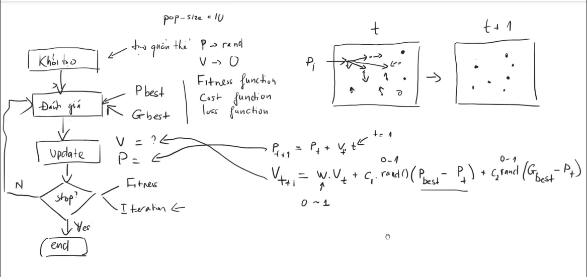

# Hướng dẫn tạo và viết code mô phỏng PSO kết hợp Mạng Nơ-ron

## Giới thiệu

Thuật toán Tối ưu hóa Bầy đàn (PSO - Particle Swarm Optimization) được sử dụng để tím kiếm tối ưu trong không gian đa chiều. Trong bài này, ta kết hợp PSO với mạng nơ-ron nhân tạo (ANN - Artificial Neural Network) để huấn luyện một hệ thống.

Code dưới đây bao gồm:
- Mô phỏng PSO.
- Mạng nơ-ron 2 đầu vào, 3 đầu ra, 2 bias, 10 nút ẩn.
- Tính toán loss (độ lệch chuẩn) cho mạng.

---

## Các bước viết code

### 1. Khai báo thư viện

```python
import numpy as np
import matplotlib.pyplot as plt
```
- `numpy`: Thư viện hỗ trợ tính toán ma trận và các phép toán số học hiệu quả.
- `matplotlib.pyplot`: Thư viện dùng để vẽ đồ thị và trực quan hóa dữ liệu.


### 2. Thiết lập tham số cơ bản

```python
# Parameters
ParticleCount = 100           # Số lượng hạt trong bầy    
ParamCount = 50               # Số lượng tham số cần tối ưu
PositionBounds = [-1, 1]      # Giới hạn vị trí tìm kiếm của các hạt  
InertiaWeight = 0.92          # Trọng số quán tính
CognitiveCoefficient = 0.90   # Hệ số học tập cá nhân
SocialCoefficient = 1.20      # Hệ số học tập xã hội
MaxIterations = 5000          # Số lần lặp tối đa
```

- Xác định tham số cho PSO.
  - `ParticleCount`: Số lượng hạt (tức là số nghiệm) trong quần thể.
  - `ParamCount`: Số lượng tham số cần tối ưu.
  - `PositionBounds`: Giới hạn của vị trí các hạt trong không gian tìm kiếm.
  - `InertiaWeight`: Hệ số quán tính, quyết định khả năng giữ tốc độ cũ của hạt.
  - `CognitiveCoefficient`: Hệ số học tập cá nhân.
  - `SocialCoefficient`: Hệ số học tập xã hội.
  - `MaxIterations`: Số vòng lặp tối đa của thuật toán.


### 3. Xây dựng cấu trúc mạng Neural Network

```python
InputLayer = 2      # Số lượng đầu vào
HiddenLayer = 10    # Số lượng lớp ẩn
OutputLayer = 3     # Số lượng đầu ra
```
- `InputLayer`: Số lượng đầu vào của mạng.
- `HiddenLayer`: Số lượng nơ-ron trong lớp ẩn.
- `OutputLayer`: Số lượng nơ-ron trong lớp đầu ra.


### 4. Khởi tạo các biến cần thiết cho PSO

```python
PersonalBestFitness = np.inf * np.ones(ParticleCount)
GlobalBestFitness = np.inf
PersonalBestPosition = np.zeros([ParticleCount, ParamCount])
GlobalBestPosition = np.zeros(ParamCount)
FitnessOverIterations = np.zeros(MaxIterations)
FitnessMinOverIterations = np.zeros(MaxIterations)
FitnessMeanOverIterations = np.zeros(MaxIterations)
ParticlePositions = np.random.uniform(PositionBounds[0], PositionBounds[1], (ParticleCount, ParamCount))
ParticleVelocities = np.zeros_like(ParticlePositions)
```
- `PersonalBestFitness`: Giá trị fitness tốt nhất của từng hạt.
- `GlobalBestFitness`: Giá trị fitness tốt nhất của toàn bộ quần thể.
- `PersonalBestPosition`: Vị trí tốt nhất của từng hạt.
- `GlobalBestPosition`: Vị trí tốt nhất của toàn bộ quần thể.
- `FitnessOverIterations`: Giá trị fitness của toàn bộ quần thể qua từng vòng lặp.
- `ParticlePositions`: Vị trí ban đầu của các hạt, được khởi tạo ngẫu nhiên.
- `ParticleVelocities`: Vận tốc ban đầu của các hạt.


### 5. Lan truyền thuận mạng nơ-ron

```python
def ForwardPropagation(Inputs, WeightsInputHidden, WeightsHiddenOutput):
    def ActivationFunction(xVal):
        return np.tanh(xVal)
    HiddenLayerInput = np.dot(WeightsInputHidden.T, Inputs)
    HiddenLayerOutput = ActivationFunction(HiddenLayerInput)
    OutputLayerInput = np.dot(WeightsHiddenOutput.T, HiddenLayerOutput)
    return OutputLayerInput
```
- Tính toán đầu ra của mạng Neural Network qua hai lớp:
  1. **Lớp ẩn**: Đầu vào nhân với trọng số và áp dụng hàm kích hoạt (tanh).
  2. **Lớp đầu ra**: Lấy đầu ra từ lớp ẩn nhân với trọng số.

### 6. Hàm chi phí

```python
def ComputeCost(Particle, WeightsHiddenOutput):
    InputData = np.array([
        [0.3, 0.35, 0.4, 0.8, 0.9, 1.0, 1.2, 1.6, 2.0],
        [0.3, 0.4, 0.5, 0.75, 0.7, 0.8, 0.4, 0.5, 0.5]
    ])
    ExpectedOutput = np.array([
        [1, 1, 1, 0, 0, 0, 0, 0, 0],
        [0, 0, 0, 1, 1, 1, 1, 1, 1],
        [0, 0, 0, 0, 0, 0, 1, 1, 1]
    ])
    WeightsInputHidden = Particle[:InputLayer * HiddenLayer].reshape(InputLayer, HiddenLayer)
    Predictions = ForwardPropagation(InputData, WeightsInputHidden, WeightsHiddenOutput)
    Error = ExpectedOutput - Predictions
    Cost = np.sum(Error**2)
    return Cost
```
- Hàm chi phí tính sai số giữa đầu ra dự đoán và đầu ra mong đợi.
- Sai số được bình phương và cộng tổng để tính giá trị chi phí.

### 7. Thuật toán PSO

```python
for Iteration in range(MaxIterations):
    for ParticleIndex, Particle in enumerate(ParticlePositions):
        WeightsInputHidden = Particle[:InputLayer * HiddenLayer].reshape(InputLayer, HiddenLayer)
        WeightsHiddenOutput = Particle[InputLayer * HiddenLayer:].reshape(HiddenLayer, OutputLayer)
        Cost = ComputeCost(Particle, WeightsHiddenOutput)
        if Cost < PersonalBestFitness[ParticleIndex]:
            PersonalBestFitness[ParticleIndex] = Cost
            PersonalBestPosition[ParticleIndex] = Particle
        if Cost < GlobalBestFitness:
            GlobalBestFitness = Cost
            GlobalBestPosition = Particle
    RandomCognitive = np.random.rand(ParticleCount, ParamCount)
    RandomSocial = np.random.rand(ParticleCount, ParamCount)
    ParticleVelocities = (
        InertiaWeight * ParticleVelocities
        + CognitiveCoefficient * RandomCognitive * (PersonalBestPosition - ParticlePositions)
        + SocialCoefficient * RandomSocial * (GlobalBestPosition - ParticlePositions)
    )
    ParticlePositions += ParticleVelocities
    ParticlePositions = np.clip(ParticlePositions, PositionBounds[0], PositionBounds[1])
    FitnessOverIterations[Iteration] = GlobalBestFitness
    FitnessMinOverIterations[Iteration] = np.min(PersonalBestFitness)
    FitnessMeanOverIterations[Iteration] = np.mean(PersonalBestFitness)
    print(f"Iteration: {Iteration}, Loss: {GlobalBestFitness:.6f}, Location: {GlobalBestPosition}")
```
- Tính toán fitness cho từng hạt.
- Cập nhật vận tốc và vị trí của từng hạt dựa trên:
  - Quán tính.
  - Thông tin học tập cá nhân.
  - Thông tin học tập xã hội.


### 8. Vẽ biểu đồ

```python
plt.figure(figsize=(12, 6))
plt.plot(FitnessOverIterations, label='Global Best Fitness')
plt.plot(FitnessMinOverIterations, label='Min Fitness Per Generation')
plt.plot(FitnessMeanOverIterations, label='Mean Fitness Per Generation')
plt.xlabel('Iteration')
plt.ylabel('Fitness')
plt.legend()
plt.title('PSO for Optimization Process')
plt.grid()
plt.show()
```
- Vẽ biểu đồ thể hiện sự thay đổi fitness qua các vòng lặp.


## Các bước nên thực hiện để có thể viết những code mô phỏng PSO kết hợp Mạng Nơ-ron
1. **Hiểu bài toán**: Xác định mục tiêu tối ưu hóa tham số mạng Neural Network.
2. **Khởi tạo tham số**: Đặt giá trị cho các tham số PSO và mạng Neural Network.
3. **Lan truyền tiến**: Viết hàm Forward Propagation để tính toán đầu ra.
4. **Hàm chi phí**: Tính sai số giữa đầu ra dự đoán và đầu ra mong đợi.
5. **PSO**:
   - Khởi tạo vị trí và vận tốc của các hạt.
   - Cập nhật vận tốc và vị trí qua từng vòng lặp.
   - Lưu giá trị fitness tốt nhất.
6. **Trực quan hóa**: Vẽ biểu đồ fitness qua các vòng lặp.

